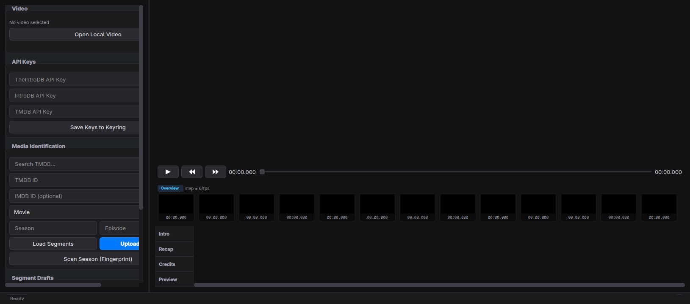

# 🎬 Segmenter

[](LICENSE)
[](https://github.com/Lynder063/segmenter/actions/workflows/release.yml)
[]()
[]()
[]()
[]()
[]()
[]()

**Segmenter** is a high-performance visual timestamp annotation and automatic AI segment detection application for macOS, Windows, and Linux. It enables users to detect, create, edit, and submit video segment markers — **Intro**, **Recap**, **Credits**, and **Preview** — to [TheIntroDB](https://theintrodb.org) (v3 API) and [IntroDB](https://introdb.app).

## Why?
I wanted to build an open-source, cross-platform tool to make creating segments easier for everyone. I hope my project will help populate TheIntroDB database. I'm just doing this for the love of the game.

> *"In a world where you can be anything, choose to be kind."* — Nitya Prakash

Sending love to everyone who uses my software,  
**Kryštof "Lynder063" Malinda**❤️

---



## 🧩 Platform Implementation

Windows and Linux run the *same* application: one shared Qt 6 core, plus a thin
platform layer, with only three files differing between them. macOS is a
separate Swift port against Apple's own frameworks. All three share the same
algorithm and the same visual design; `docs/screenshot.png` is the contract
for what the window looks like.

## ✨ Key Native Features

### 🎬 High-Performance Video Engine (LibVLC)
- **100% Codec & Container Support**: Native playback for MKV, MP4, AVI, MOV, HEVC (x265), H.264, AC3, DTS, and 10-bit HDR streams.
- **Hardware Decoding**: Apple VideoToolbox on macOS, DirectX on Windows.
- **Sub-Millisecond Real-Time Playback**: high-precision timecode clock rendering millisecond-accurate timestamps (`02:15.842`).
- **Instant Paused Seeking**: frame-accurate stepping rendering instant video keyframes when paused.

### 🔍 Interactive Zoomable Multi-Track Timeline ($1.0\times - 50.0\times$)
- **Pinch-to-Zoom & Trackpad Gestures**: smooth magnify and scroll-wheel panning across the multi-track timeline. `Ctrl`+wheel zooms, wheel pans.
- **Dynamic Time Ruler Ticks**: automatically adjusts timecode grid ticks from 5-minute intervals down to 1-second and 250 ms sub-frame intervals.
- **Zoom Controls Toolbar**: quick zoom slider, `+`/`-` buttons, `1x` reset, and a `⌖ Scope` center-on-playhead action.
- **Direct Editing**: drag a segment whole, or by either edge, with undo/redo coalescing the whole drag into one step.

### 🤖 RCD Season Fingerprinting
Scan entire season folders or standalone episodes with **4 detection methods**, all built on a 12-bin chroma pitch-class fingerprint cross-correlated between episodes:

1. **`HW Accelerated (SIMD FFT + OCR)`**: Chromaprint 12-bin pitch chromagram cross-correlation + on-screen text rectangle density and black-frame visual snapping ($\bar{L} < 30 / 255$).
2. **`Chromaprint 12-Bin Pitch Chromagram`**: pure acoustical pitch class profile cross-correlation. Fastest — never extracts a video frame.
3. **`Multimodal Fusion`**: dual score fusion ($60\% \text{ Audio Chroma} + 40\% \text{ Vision}$).
4. **`Single Episode (Standalone)`**: structural analysis of one file, locating the longest sustained run of music-like audio near the start and end. Requires no season directory.

Supporting behaviour:
- **Search regions scale with episode length**, so a 22-minute animation and a 50-minute drama search a comparable fraction of their runtime.
- **Adaptive thresholds** step down $0.80 \rightarrow 0.65 \rightarrow 0.50 \rightarrow 0.40$ until a template is found.
- **Credits vs. preview is settled visually** — both recur at the end of every episode and score alike on audio, but only one is a dense crawl of names.
- **Feature cache** keyed by file size and modification time, so re-scanning a season with a different method or threshold skips decode and FFT entirely.
- Every scan writes a log of what it found, what it scored, and which threshold it fell back to.

### 🖼️ Real-Time Dynamic Frame Strip
- In-memory stdout frame extraction pipe for non-native MKV/x265 files ($<0.02\text{s}$ per frame).
- 13-frame preview strip centered around the playhead for frame-accurate boundary placement.

### 🔑 Secure Key Storage & TheIntroDB v3 API
- API keys stored in the native **macOS Keychain** and **Windows Credential Manager**.
- Full submission compatibility with **TheIntroDB v3 API** including `video_duration_ms`, `start_ms`, `end_ms`, `tmdb_id`, and `imdb_id`.
- Support for TMDB v3 API Keys and v4 Read Access Bearer Tokens with automatic metadata resolution.

### 🎮 Discord Rich Presence
Shows what you're editing — idle, loaded, playing, paused or scanning — as
your Discord status, on all three platforms. Optional and off by default:
copy `.env.example` to `.env` at the repo root and set `DISCORD_CLIENT_ID` to
a Discord application you control
([discord.com/developers/applications](https://discord.com/developers/applications),
with a Rich Presence art asset uploaded under the key `segmenter_logo`)
before building. No `.env`, no client ID compiled in, no connection
attempted — nothing else about the app depends on it. Windows/Linux read
`.env` at CMake configure time (`core/src/services/DiscordRpcService`);
macOS's `build.sh` reads it at the start of every build and generates
`Sources/Segmenter/Generated/DiscordConfig.swift`
(`DiscordRPCService.swift` is a from-scratch Swift port of the same protocol,
independent of the Qt/CMake one since macOS builds via SwiftPM instead).

---

## ⌨️ Controls & Keyboard Shortcuts

| Shortcut | Action |
|---|---|
| <kbd>Space</kbd> | Toggle play / pause |
| <kbd>←</kbd> / <kbd>→</kbd> or <kbd>,</kbd> / <kbd>.</kbd> | Step one frame backward / forward |
| <kbd>I</kbd> / <kbd>Shift+I</kbd> | Set Intro start / end |
| <kbd>R</kbd> / <kbd>Shift+R</kbd> | Set Recap start / end |
| <kbd>C</kbd> / <kbd>Shift+C</kbd> | Set Credits start / end |
| <kbd>P</kbd> / <kbd>Shift+P</kbd> | Set Preview start / end |
| <kbd>Ctrl+Z</kbd> / <kbd>Ctrl+Shift+Z</kbd> | Undo / redo |
| <kbd>Escape</kbd> / <kbd>Return</kbd> | Clear text input focus & return keyboard controls to player |
| **Pinch Gesture** | Zoom timeline in / out ($1.0\times - 50.0\times$) |
| **Trackpad Pan** | Scroll timeline horizontally |

---

## 📦 Download & Build

Every push of a version tag builds and publishes installers for all three
platforms via [GitHub Actions](.github/workflows/release.yml) — grab the
latest from the [Releases page](https://github.com/Lynder063/segmenter/releases)
if you'd rather not build from source:

| Platform | File | Notes |
|---|---|---|
| Debian / Ubuntu / Mint | `segmenter_*_amd64.deb` | `sudo apt install ./segmenter_*.deb` |
| Fedora / RHEL / openSUSE | `segmenter-*.x86_64.rpm` | `sudo dnf install ./segmenter-*.rpm` |
| Arch / Manjaro | `PKGBUILD` | `makepkg -si` |
| Any Linux, sandboxed | `Segmenter-*-x86_64.flatpak` | `flatpak install ./Segmenter-*.flatpak` |
| Any Linux, no install | `Segmenter-*-x86_64.AppImage` | `chmod +x` and run |
| Windows 10/11 x64 | `Segmenter-windows-x64.zip` | unzip and run `Segmenter.exe` |
| macOS 12+ (Apple Silicon + Intel) | `Segmenter-macos-universal.zip` | unzip and run; unsigned, so right-click → Open the first time |

Building from source instead:

### macOS (Universal Binary `arm64` + `x86_64`)

```bash
./mac/native/build.sh
```

```bash
./mac/native/dist/Segmenter.app/Contents/MacOS/Segmenter
```

For Discord Rich Presence, drop a `.env` next to this README (see
[Optional: Discord Rich Presence](#optional-discord-rich-presence) below)
before running `build.sh` — it reads it on every run.

### Windows (Qt 6 / C++)

Requires Visual Studio 2022 Build Tools with the C++ workload, CMake, Ninja, Qt 6.5+ (`msvc2022_64`), and `ffmpeg` on `PATH`.

```powershell
winget install Microsoft.VisualStudio.2022.BuildTools --override "--wait --quiet --add Microsoft.VisualStudio.Workload.VCTools --includeRecommended"
```

```powershell
winget install Kitware.CMake Ninja-build.Ninja Gyan.FFmpeg
```

```powershell
python -m pip install aqtinstall; python -m aqt install-qt windows desktop 6.8.3 win64_msvc2022_64 --outputdir C:\Qt
```

The LibVLC SDK is ~100 MB of third-party binaries and is not committed. Fetch it into `windows/native/third_party/vlc`, laying out `build/x64` from the NuGet package as `sdk/include`, `sdk/lib`, `plugins`, plus `libvlc.dll` and `libvlccore.dll` at the root:

```powershell
Invoke-WebRequest https://www.nuget.org/api/v2/package/VideoLAN.LibVLC.Windows/3.0.21 -OutFile libvlc.zip
```

Then build:

```powershell
powershell -File windows\native\build.ps1 -Configuration Release -Run
```

The packaged app is `windows\native\dist\Segmenter.exe`. The raw build output at `build\Release\bin\Segmenter.exe` runs too — CMake stages the Qt and LibVLC runtime beside it.

Headless scanning, for batch work or for checking a detection change against known timings:

```powershell
windows\native\dist\Segmenter.exe --scan "Z:\shows\Some Show\Season 01"
```

### Linux (Qt 6 / C++)

Everything is available from the distribution's own repositories, so one command
installs the lot:

```bash
./linux/native/build.sh --install-deps
```

```bash
./linux/native/build.sh --run
```

Build `.deb`, `.rpm` and AppImage packages:

```bash
./linux/native/package.sh --version 1.0.0
```

Arch/AUR users build from `linux/native/PKGBUILD` directly (`makepkg -si`); it
is not produced by `package.sh` since it is a source recipe rather than a
built package. A sandboxed Flatpak build is also available:

```bash
./linux/native/flatpak/build.sh --version 1.0.0
```

`libsecret` and Tesseract are optional — the build reports which it found and
what it falls back to without them.

### Optional: Discord Rich Presence

Off by default on every checkout but the maintainer's own. To enable it locally:

```bash
cp .env.example .env
# then set DISCORD_CLIENT_ID= in .env before building
# (Windows/Linux: before running cmake; macOS: before running build.sh)
```

---

## 🧰 Troubleshooting

**The app starts but no window appears.** Check the log — it records what the UI cannot show you. On Windows: `%LOCALAPPDATA%\Segmenter\Segmenter\segmenter.log`.

**"Scan complete — 0 segments".** Almost always missing `ffmpeg`/`ffprobe`; the scan log names the paths it resolved at the top. Install with `winget install Gyan.FFmpeg`, or place `ffmpeg.exe` and `ffprobe.exe` in a `bin` folder next to the executable.

**Detection found the preview instead of the credits.** The visual pass needs an OCR recognizer. If the log says `OCR unavailable`, install a Windows language pack — without it the engine falls back to audio only, which cannot tell the two apart.

**Re-scanning is as slow as the first scan.** The feature cache keys on file size and modification time, so a re-encode or a touched timestamp invalidates it — correctly.

**Linux: two titlebars, or the video area is blank under GNOME/Wayland.** Both are handled already — the video surface renders via LibVLC's raw callbacks rather than window embedding (works identically on X11 and Wayland), and `main.cpp` requests Qt's `adwaita` Wayland decoration plugin so Mutter doesn't double-draw a titlebar. If you still see either on a very old build, update.

---

## 📄 License

Distributed under the MIT License. See [`LICENSE`](LICENSE) for details.
